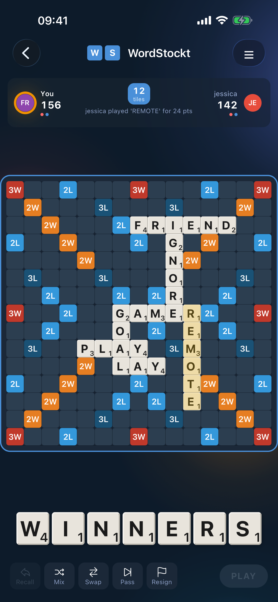
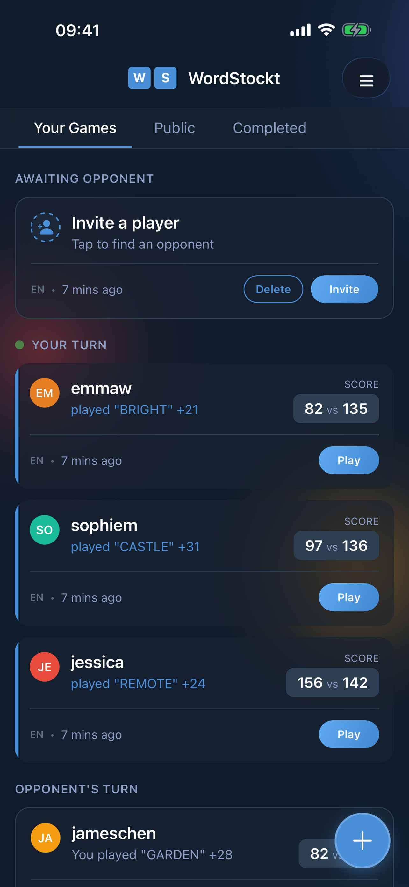
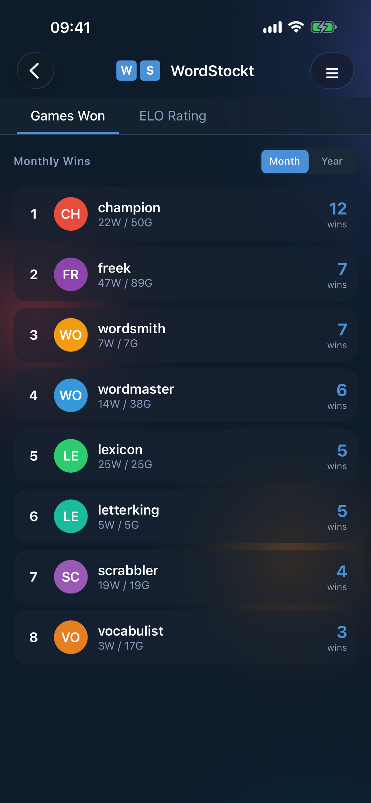
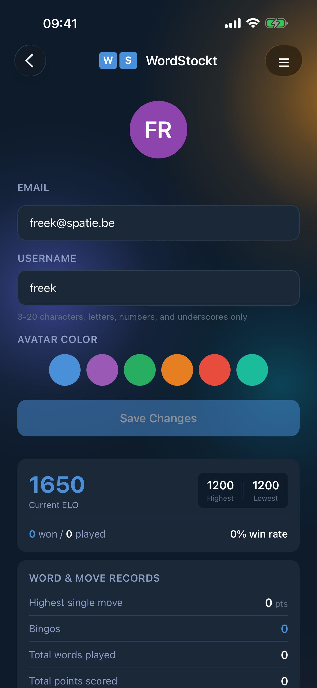

# WordStockt

A multiplayer word game. This repository contains the Laravel backend (API and public website) that powers the [mobile app](https://github.com/spatie/wordstockt-app).

**Download:** [iOS App Store](https://apps.apple.com/app/wordstockt/id6757525145) · [Google Play Store](https://play.google.com/store/apps/details?id=com.wordstockt.app)

## About

WordStockt lets you challenge friends to word battles on a 15x15 board. Form words, score points, and prove your vocabulary prowess.

Read about [how this was built in ~10 days](https://freek.dev/2983-i-built-a-native-mobile-word-game-in-two-weeks) as an experiment in AI-assisted development.

## Features

- Asynchronous multiplayer matches with friends
- Player statistics and leaderboards
- Push notifications for turn alerts
- Real-time updates via WebSockets
- Free with no advertisements
- Available on iOS and Android

## Screenshots

<p align="center">
  
  
  
  
</p>

## Tech Stack

- PHP 8.4 / Laravel 12
- Laravel Sanctum for API authentication
- Laravel Reverb for real-time WebSocket communication
- Laravel Horizon for queue management
- Filament for admin panel
- SQLite (development) / MySQL (production)
- Pest for testing

## Requirements

- PHP 8.4+
- Composer
- Node.js (for Reverb)

## Installation

```bash
# Clone the repository
git clone git@github.com:spatie/wordstockt.com.git
cd wordstockt.com

# Install dependencies
composer install

# Set up environment
cp .env.example .env
php artisan key:generate

# Run migrations and seed
php artisan migrate --seed
```

## Development

```bash
# Start the WebSocket server
php artisan reverb:start

# Start Horizon (queue manager)
php artisan horizon:watch
```

Test users are available after seeding:
- `freek@spatie.be` / `password`
- `marvin@spatie.be` / `password`

## Testing

```bash
composer test
```

## Composer Scripts

The project includes several useful composer scripts for development:

### Code Quality

- `composer test` - Run the test suite using Pest
- `composer analyse` - Run PHPStan static analysis
- `composer rector` - Run Rector for automated code improvements

### Mobile App

Run the interactive app helper:

```bash
php artisan app
```

This guides you through:
- **Run dev server** - Hot reload on simulator/browser
- **Build app** - EAS cloud build → download from expo.dev
- **Build + submit** - Build and upload to TestFlight
- **Push JS update** - Instant OTA update to installed apps

## Contributing

Contributions are welcome! Please feel free to submit a Pull Request.

## License

The MIT License (MIT). Please see [License File](LICENSE.md) for more information.
